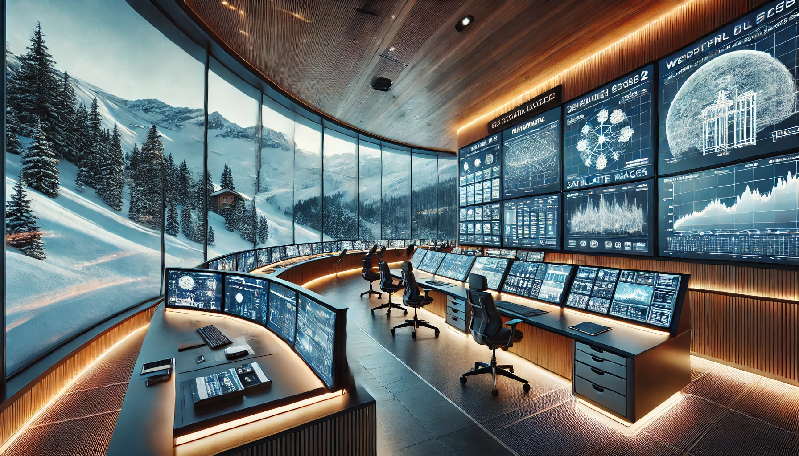

# Alpine Control Room

Alpine Control Room is a web application designed to view and monitor various ski resort webcams in the Alps. For now, it supports only a few ski resort, in the future, more will be supported.



## Features

At its latest release, Alpine Control Room allows users to:

- Monitor webcam in (almost) real-time
- Visualize webcam locations on a map
- Consult avalanche and ground snow bulletins prepared by some Italian environmental monitoring institutions

## Local setup

If you don't want to instal the repository and run it locally, there is a GitHub page linked to this projec, when you can see the web application running.

### Installation

To set up the project locally, follow these steps:

1. Clone the repository:

    ```sh
    git clone https://github.com/yourusername/alpine-control-room.git
    ```

2. Navigate to the project directory:

    ```sh
    cd alpine-control-room
    ```

3. Install dependencies:

    ```sh
    npm install
    ```

### Usage

To start the development server, run:

```sh
npm run dev
```

Then, follow the instruction on the terminal to view the webapp.

### Build

To build the project for production, run:

```sh
npm run build
```

The output will be in the `dist` directory.

## License

This project is licensed under the Creative Commons Attribution-NonCommercial-NoDerivatives 4.0 International License. For more details, see [LICENSE](https://creativecommons.org/licenses/by-nc-nd/4.0/).
